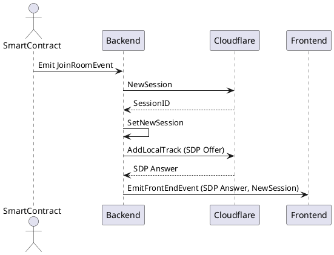
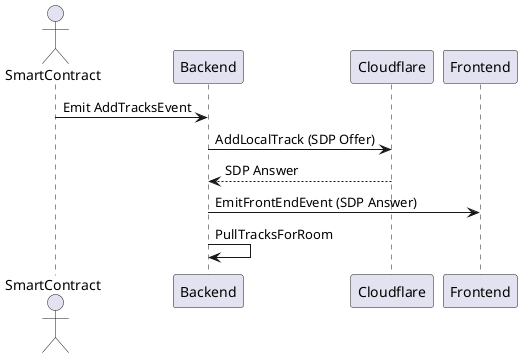
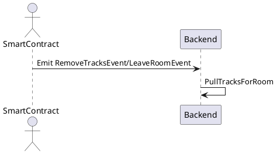
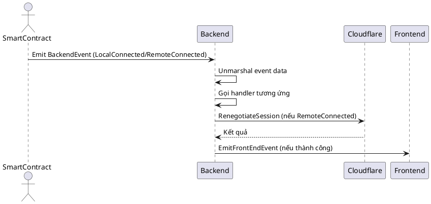

# Tài liệu luồng sự kiện backend MeetApp

## 1. Tổng quan luồng sự kiện

Backend của MeetApp sử dụng mô hình event-driven, nhận các sự kiện từ smart contract (blockchain) và xử lý qua các handler tương ứng. Các event chính gồm: JoinRoom, AddTracks, RemoveTracks, LeaveRoom, Backend (LocalConnected, RemoteConnected).

Luồng tổng quát:
- Smart contract phát sinh event (ví dụ: JoinRoom)
- Backend subscribe event qua các hàm Sub*Event
- Khi nhận event, backend gọi handler tương ứng (ví dụ: JoinRoomHandler)
- Handler xử lý logic (tạo session, cập nhật trạng thái, gửi event về frontend...)

## 2. Cách chạy backend

### Yêu cầu
- Go >= 1.20
- Đã cài đặt các dependency (sử dụng `go mod tidy` nếu cần)

### Build & Run
```bash
cd server
make build   # hoặc go build ./cmd/...
make run     # hoặc chạy binary tương ứng
```

### Các lệnh Makefile phổ biến
- `make build`: Build toàn bộ project
- `make run`: Chạy server

## 3. Sơ đồ sequence các event chính

### JoinRoom Event


### AddTracks Event


### RemoveTracks/LeaveRoom Event


### Backend Event (LocalConnected/RemoteConnected)


## 4. Giải thích chi tiết các event

### JoinRoomEvent
- Tạo session mới trên Cloudflare
- Lưu session vào backend
- Add local track (SDP Offer -> SDP Answer)
- Gửi kết quả về frontend

### AddTracksEvent
- Add local track vào session hiện tại
- Gửi SDP Answer về frontend
- Kéo lại toàn bộ tracks của phòng

### RemoveTracksEvent/LeaveRoomEvent
- Kéo lại toàn bộ tracks của phòng để cập nhật trạng thái

### BackendEvent
- Nếu là LocalConnected: gọi handler LocalConnectedHandler
- Nếu là RemoteConnected: gọi handler RemoteConnectedHandler (renegotiate session, gửi event về frontend)

---

*File này tự động sinh bởi AI dựa trên source code và cấu trúc dự án.* 